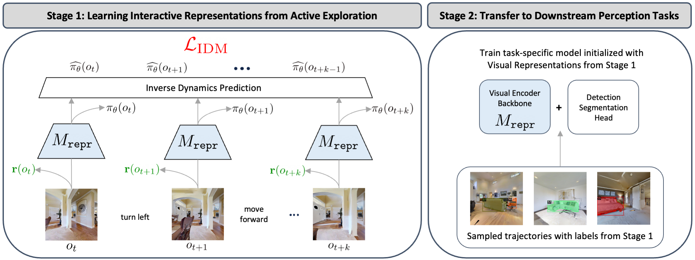

# ALP: Action-Aware Embodied Learning for Perception

Current methods in training and benchmarking vision models exhibit an over-reliance on passive, curated datasets. Although models trained on these datasets have shown strong performance in a wide variety of tasks such as classification, detection, and segmentation, they fundamentally are unable to generalize to an ever-evolving world due to constant out-of-distribution shifts of input data. Therefore, instead of training on fixed datasets, can we approach learning in a more human-centric and adaptive manner? In this paper, we introduce \textbf{A}ction-aware Embodied \textbf{L}earning for \textbf{P}erception (ALP), an embodied learning framework that incorporates action information into representation learning through a combination of optimizing policy gradients through reinforcement learning and inverse dynamics prediction objectives. Our method actively explores complex 3D environments to both learn generalizable task-agnostic representations as well as collect downstream training data. We show that ALP outperforms existing baselines in object detection and semantic segmentation. In addition, we show that by training on actively collected data more relevant to the environment and task, our method generalizes more robustly to downstream tasks compared to models pre-trained on fixed datasets such as ImageNet.



## Installation

Create conda environment with python>=3.7 and cmake>=3.10:
```bash
conda create -n alp python=3.7 cmake=3.14.0
conda activate alp
```

We use pytorch v1.10.0 and cuda 11.3:
```bash
pip install torch==1.10.0+cu113 torchvision==0.11.0+cu113 torchaudio==0.10.0+cu113 -f https://download.pytorch.org/whl/cu113/torch_stable.html
```

We use earlier version of [habitat-sim](https://github.com/facebookresearch/habitat-sim):
```bash
git clone https://github.com/facebookresearch/habitat-sim.git
cd habitat-sim; git checkout tags/v0.1.5; 
pip install -r requirements.txt 
python setup.py install --headless
```

We use custom implementation based on earlier version of [habitat-lab](https://github.com/facebookresearch/habitat-lab):
```bash
git clone --branch alp-pkg https://github.com/xinranliang/habitat-lab.git
cd habitat-lab
pip install -e .
pip install -r requirements.txt
python setup.py develop --all # install habitat-lab and habitat-baselines
```

Install [detectron2](https://github.com/facebookresearch/detectron2) from released package:
```bash
python -m pip install detectron2 -f https://dl.fbaipublicfiles.com/detectron2/wheels/cu113/torch1.10/index.html
```

Install additional dependencies:
```bash
pip install -r requirements.txt
```

Please refer to [`data/README.md`](./data/README.md) for details in setting up training and evaluation dataset.


## Running the code

### Training visual representations and exploration policy

For ALP with RND exploration, please use following scripts:
```bash
bash scripts/pretrain/run_rnd_alp.sh [CUDA_VISIBLE_DEVICES] [num_gpus_per_node]
```

For ALP with CRL exploration, please use following scripts:
```bash
bash scripts/pretrain/run_crl_alp.sh [CUDA_VISIBLE_DEVICES] [num_gpus_per_node]
```

For compute requirements, we use 5 GPUs each training 4 environment processes with 24GB memory. You could change `NUM_PROCESSES` in config.yaml files to training different numbers of environment processes in parallel.

To generate videos and maps of agent behaviors, please use following scripts:
```bash
CUDA_VISIBLE_DEVICES=[CUDA_VISIBLE_DEVICES] python src/pretrain/run_ddppo.py --exp-config configs/visualize/[AGENT].yaml --run-type eval
```
You may need to download PointNav-v1 dataset in Gibson scenes following [here](https://github.com/xinranliang/habitat-lab/tree/alp-pkg#data), and modify relative path to dataset directory and model checkpoint.

### Training and evaluating downstream perception models

Please use following scripts to train Mask-RCNN models:

```bash
CUDA_VISIBLE_DEVICES=[CUDA_VISIBLE_DEVICES] python src/mask_rcnn/plain_train_net.py \
--date [exp_date] --dataset-dir /path/to/samples_dir/ \
--pretrain-weights {random, imagenet-sup, sim-pretrain} --pretrain-path /path/to/simulator_trained_repr/ \
--num-gpus [num_gpus] --max-iter [total_train_iters] --batch-size [batch_size]
```

More specific settings and default values are listed below:
- `--dataset-dir`: relative path to folder directory that saves labeled samples from a small random subset of actively explored frames.
- `--pretrain-weights`: weight init of downstream perception model. `random` refers to random initialization and `imagenet-sup` refers to init from ImageNet supervised model trained for classification task. `sim-pretrain` initializes from visual representation pretrained in simulator; you need to provide relative path to pretrained model weights using argument `--pretrain-path`.
- `--max-iter` and `--batch-size`: we use `batch_size=32` to train on 4 GPUs each with 12GB memory.

To evaluate Mask-RCNN models, in addition to above training script, add `--eval-only` argument and provide relative path to downstream model weights using argument `--model-path`.


## Citation

If you find our code and work useful for your research, please consider citing our [paper](https://arxiv.org/abs/2306.10190):

```
@article{liang2023alp,
  title={ALP: Action-Aware Embodied Learning for Perception},
  author={Liang, Xinran and Han, Anthony and Yan, Wilson and Raghunathan, Aditi and Abbeel, Pieter},
  journal={arXiv preprint arXiv:2306.10190},
  year={2023}
}
```